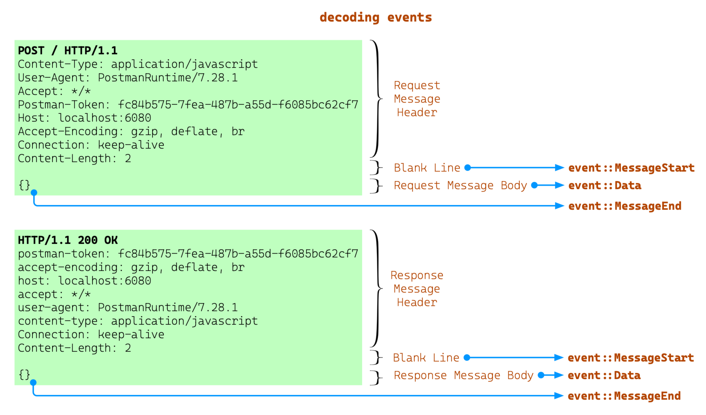

# 02-路由

流量管理中，对请求的路由是比较常见的操作。下面的这段脚本，演示了如何使用 pipy js 的脚本实现路由功能。

[`02-routing/proxy.js`](https://github.com/flomesh-io/pipy/blob/main/tutorial/02-routing/proxy.js)

```js
pipy({
  _router: new algo.URLRouter({
    '/*'   : '127.0.0.1:8080',
    '/hi/*': '127.0.0.1:8081',
  }),

  _target: '',
})

.listen(8000)
  .demuxHTTP('routing')

.pipeline('routing')
  .handleMessageStart(
    msg => (
      _target = _router.find(
        msg.head.headers.host,
        msg.head.path,
      )
    )
  )
  .link(
    'forward', () => Boolean(_target),
    '404'
  )

.pipeline('forward')
  .muxHTTP(
    'connection',
    () => _target
  )

.pipeline('connection')
  .connect(
    () => _target
  )

.pipeline('404')
  .replaceMessage(
    new Message({ status: 404 }, 'No route')
  )
```

脚本中有两个自定义的全局变量：
* `_router` 是使用内置 `algo.URLRouter` 实现的路由表。`URLRouter` 接收一个 Object 对象进行初始化。键为 `url`（支持正则），值为目标服务的地址；提供 `#find` 方法进行路由匹配。
* `_target` 是初始化为空字符串的变量，路由决策目标服务的地址。路由决策结果需要是每个请求独立的，需要在 `demuxHTTP` 过滤器中完成路由的决策和执行，`demuxHTTP` 的详细解读可以看[01-基础输出](01-hello_zh.md) 中的 **demuxHTTP 过滤器**。

### 路由决策

这里我们想要根据 url 完成路由决策，而 `host` 和 `path` 来自 HTTP 协议头部。

下图是在解码消息的不同时间点所产生的事件，从图中可以看到在解析完整个头部后会发出 `MessageStart` 事件，此时我们可以获取到 HTTP 协议头。



在 pipy 过滤器中有不少用于监听事件的过滤器（通过 `pipy --list-filters` 或者 `pipy --help-filters` 浏览），其中的 `handleMessageStart` 可以监控到 `MessageStart` 获取到头部数据。

`handleMessageStart` 接收一个函数作为参数，函数的参数为 `Message` 对象。可以在这个函数完成路由决策，即全局变量 `_target` 的赋值。

```js
.handleMessageStart(
    msg => (
      _target = _router.find(
        msg.head.headers.host,
        msg.head.path,
    )
)
```

### 路由

完成路由决策后的下一步就是路由了，路由的结果可能是目标地址，也可能匹配不到路由。需要根据不同的结果进行判断，在内置的过滤器中 `link` 支持条件判断：`link(target[, when[, target2[, when2, ...]]])`。

```js
.link(
    'forward', () => Boolean(_target), //匹配到路由时，发送到 forward 执行
    '404' //无法匹配路由时，发送到 404 执行、
)
```

### 转发请求

这里使用 `muxHTTP` 过滤器，内置了一个 `ConnectionManager` 实现连接的多路复用。

使用的语法 `muxHTTP(target[, channel])`，是否复用连接通过 `channel` 来控制。<u>值相同，则会使用相同的连接；不同则使用不同的连接。如果不提供则每次都会创建新的连接。</u>

前面做路由决策时将请求做了解码，转发之前 `muxHTTP` 会再次编码。

```js
.pipeline('forward')
  .muxHTTP(
    'connection',
    () => _target // 使用目标服务地址作为 channel，即表示同一目标的路由请求都共用同一个连接
  )

.pipeline('connection')
  .connect(
    () => _target
  )
```