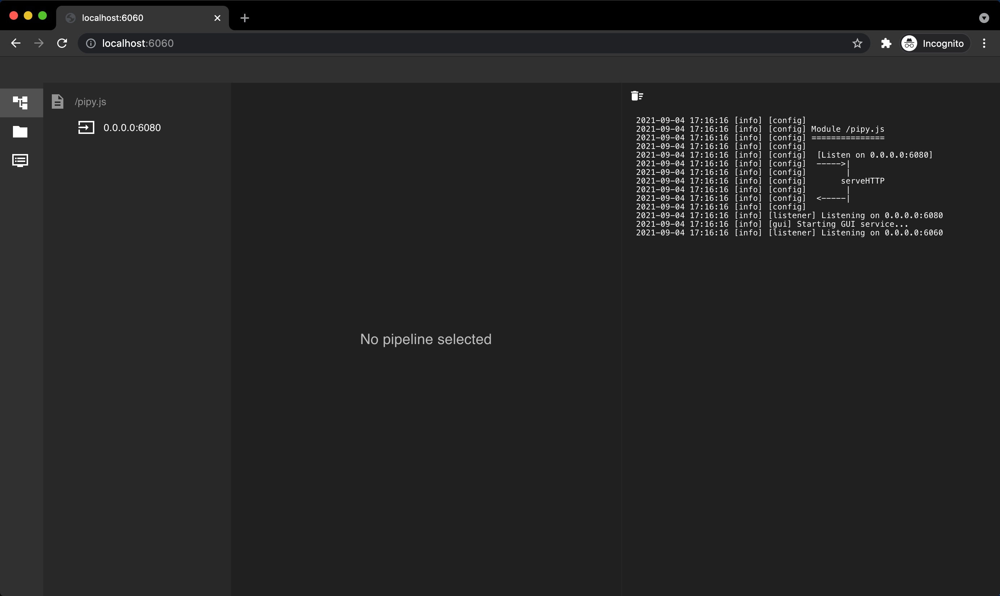
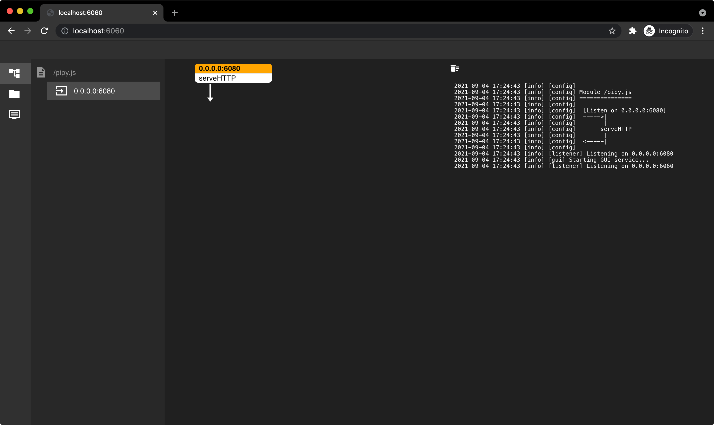
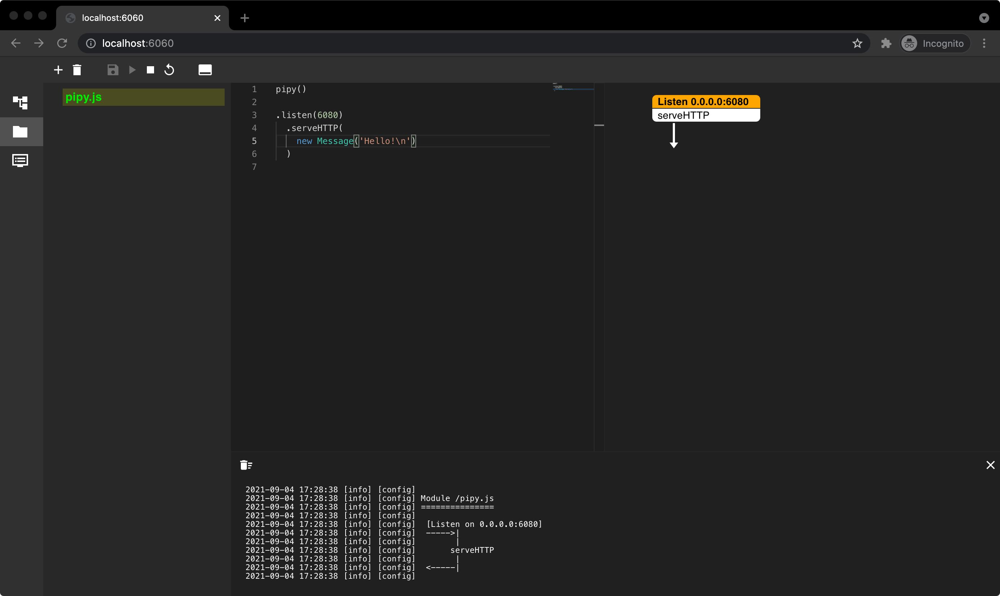

# 000-启动与web控制台的使用

[Pipy](https://github.com/flomesh-io/pipy) 是一个轻量级、高性能、高稳定、可编程的网络代理。可编程则是 Pipy 的灵魂 -- 可以通过编程的方式制定流量的处理规则，而规则是客户化价值的载体。

JS 的语义简单直接，适合编写这样的规则；内置的 JS 的引擎适合描述流量的处理规则，交由执行引擎 Pipy 来执行对流量的处理。

规则是灵活且多变的，客户的工作量就集中在规则的开发和调试上，一款便捷的规则开发工具是必要的。Pipy 中内置的 pipy console 以 web 的方式提供了开发工具所应有的功能。

Pipy 除了可以在系统边缘处理“南北向”的流量，还可以作为服务网格中的 sidecar 来处理“东西向”的流量。如此，规则又称为服务网格的核心。容器网络的隔离特性，使得网格中的规则调试更加困难，因为 Kubernetes 集群与服务网格可能隶属于不同的团队。此时，可以暴露 pipy console 的 web 端口可以进行便捷的调试。

这里就为大家介绍一下 pipy console 的使用。

## 启动 Pipy

Pipy 编译之后的 `bin` 目录中只有一个 11 Mb 大小的独立可执行文件。如果不想编译，可以从 [这里](https://github.com/flomesh-io/pipy/releases) 下载二进制文件。

启动也很简单，只需要指定 javascript 脚本文件即可：`bin/pipy path_to_js_file`，或者 `bin/pipy http://host:port/script`。

比如：

```text
$ cat > /tmp/pipy.js <<EOF
pipy()

.listen(6080)
  .serveHTTP(
    new Message('Hello!\n')
  )
EOF

$ bin/pipy /tmp/pipy.js
2021-09-04 17:13:45 [info] [config]
2021-09-04 17:13:45 [info] [config] Module /pipy.js
2021-09-04 17:13:45 [info] [config] ===============
2021-09-04 17:13:45 [info] [config]
2021-09-04 17:13:45 [info] [config]  [Listen on 0.0.0.0:6080]
2021-09-04 17:13:45 [info] [config]  ----->|
2021-09-04 17:13:45 [info] [config]        |
2021-09-04 17:13:45 [info] [config]       serveHTTP
2021-09-04 17:13:45 [info] [config]        |
2021-09-04 17:13:45 [info] [config]  <-----|
2021-09-04 17:13:45 [info] [config]
2021-09-04 17:13:45 [info] [listener] Listening on 0.0.0.0:6080
```

执行完上面两条命令，即可监听本地的 `6080` 端口，尝试发起一个请求：

```text
curl localhost:6080
Hello!
```

此外，可以通过指定 `-h` 选项，可以查看 Pipy 的帮助信息。

```text
$ bin/pipy -h
Usage: pipy [options] <script filename>

Options:
  -h, -help, --help                    Show help information
  -v, -version, --version              Show version information
  --list-filters                       List all filters
  --help-filters                       Show detailed usage information for all filters
  --log-level=<debug|info|warn|error>  Set the level of log output
  --verify                             Verify configuration only
  --reuse-port                         Enable kernel load balancing for all listening ports
  --gui-port=<port>                    Enable web GUI on the specified port
```

前面的示例中，我们在 `pipy.js` 文件中键入了几行代码（具体代码在后续教程中进行说明）实现了简单的请求/响应。假如要修改响应的内容要怎么办？比如返回 “Hello World!”

1. `CTRL+C`退出进程
2. 修改脚本文件里的响应内容
3. 重新启动 Pipy

有没有更简单的方法？有！

## Pipy Console

Pipy Console 的开启很简单，前面查看 Pipy 的帮助信息时有看到 `--gui-port=<port> Enable web GUI on the specified port`。

我们调整下前面的命令，加上 `--gui-port=6060` 选项：

```text
$ bin/pipy --gui-port=6060 /tmp/pipy.js
2021-09-04 17:16:16 [info] [config]
2021-09-04 17:16:16 [info] [config] Module /pipy.js
2021-09-04 17:16:16 [info] [config] ===============
2021-09-04 17:16:16 [info] [config]
2021-09-04 17:16:16 [info] [config]  [Listen on 0.0.0.0:6080]
2021-09-04 17:16:16 [info] [config]  ----->|
2021-09-04 17:16:16 [info] [config]        |
2021-09-04 17:16:16 [info] [config]       serveHTTP
2021-09-04 17:16:16 [info] [config]        |
2021-09-04 17:16:16 [info] [config]  <-----|
2021-09-04 17:16:16 [info] [config]
2021-09-04 17:16:16 [info] [listener] Listening on 0.0.0.0:6080
2021-09-04 17:16:16 [info] [gui] Starting GUI service...
2021-09-04 17:16:16 [info] [listener] Listening on 0.0.0.0:6060
```

命令输出中说明了 GUI 监听在 `6060` 端口。



从左到右依次为：导航栏、当前生效的模块及 Pipeline、选中的 Pipeline 的结构、日志。

导航栏从上到下依次为：首页、脚本编辑器、日志。

选中一个 Pipeline，第三栏中会展示出该 Pipeline 所使用的过滤器。



前面我们提出了问题：如何快速的修改脚本并调试。打开脚本编辑器，选中我们的脚本文件：



脚本编辑器上方的工具栏中从左到右依次为：增加脚本、删除脚本、保存、启动、停止、重载、打开/关闭日志面板。


修改响应内容后，可以看到工具栏的保存按钮高亮了，这里需要点击进行保存。

```text
$ curl http://127.0.0.1:6080
Hello!
```

只保存还不够，需要点击重载按钮。

```text
$ curl http://127.0.0.1:6080
Hello World!
```